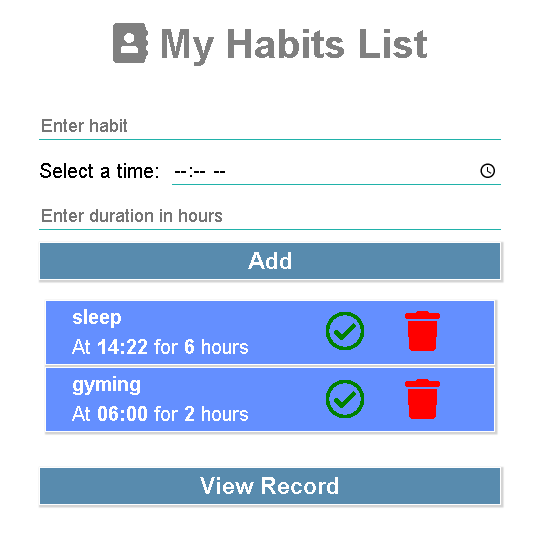
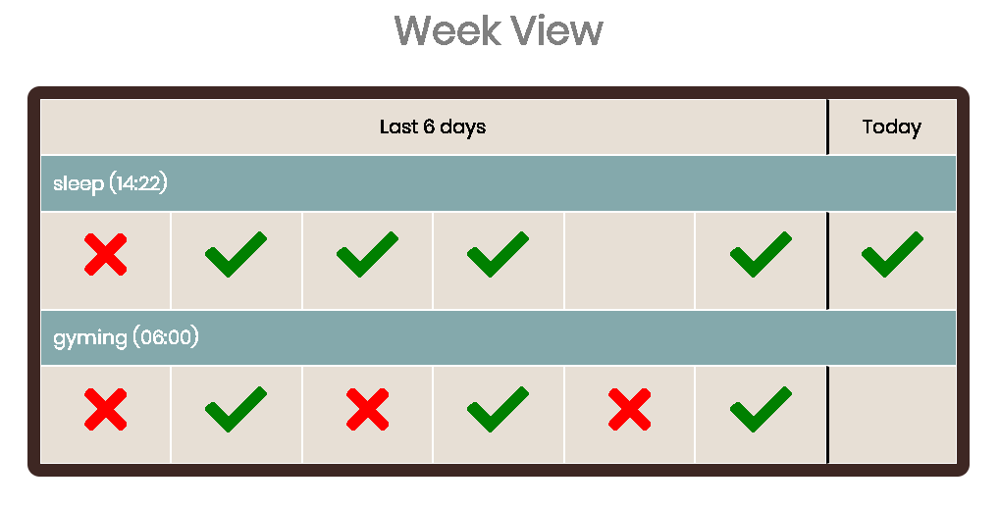

# Habit Tracker app
A habit tracker app. build using node.js, ejs as a template engine and data storage done in local mongod

### Video Link -> https://youtu.be/tXU3bI66Ayc

### Directory Structure followed

- assets
  - css
  - js
  - images
- config
- models
- views
- index.js
- package.json
- package-lock.json  

### General steps to follow when creating a project

- Setup nodejs (npm init)
- Setup express (npm install express)
- Setup template engine (npm install ejs)
- Functionality Added
	- Add a Habit
	- Delete a habit
	- View records of added habit
	- manipulate the status of habit weekly
- Setup Mongoose (npm install mongoose)
- DB Schema
	- object {name,time,duration,today,lastday1...6}

- Start the project
  - fireup mongod
  - node index.js / nodemon index.js
  - open robo3T (optional - just to visualize the db)

### Screenshots of the App

